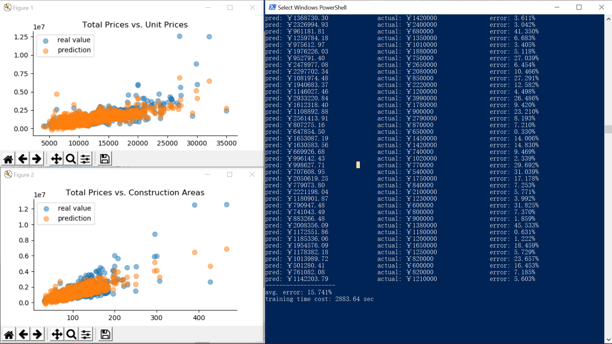

# house_price_prediction
Predict second-hand housing prices in Shenyang, China, based on [链家](https://sy.lianjia.com/ershoufang/)
## About
19' summer intern project, as a **glimpse of Big Data Applications**, including
- **Data Acquisition**
    - Web Crawler: Scrapy
    - Advanced Python, e.g., generator, lambda and functools
    - XPath
    - Regular Expression
- **Data Analysis**
    - Linear Regression, using the following to optimize
        - Least Square Method
        - Batch Gradient Descent
    - Fully-connected NN, using
        - Keras with tensorflow backend
    - NumPy, matplotlib to power / evaluate trained model
## Results
**Linear Regression (LSM)**

**Linear Regression (BGD)**

**Fully-connected NN (1-layered)**

## Usage
1. **run crawler**
    - `cd housing_spider`
    - `scrapy crawl houses_info`
    - the crawled data would be stored in `houses_info.csv` in project root
2. **run linear regression / deep learning**
    - `python run_lr.py` / `python run_dl.py`
    - optimizers (LSM / BGD) can be chosen in `run_lr.py`

## Dependencies
- Python 3.x
- Scrapy
- TensorFlow 1.x
- Keras
- NumPy
- matplotlib
